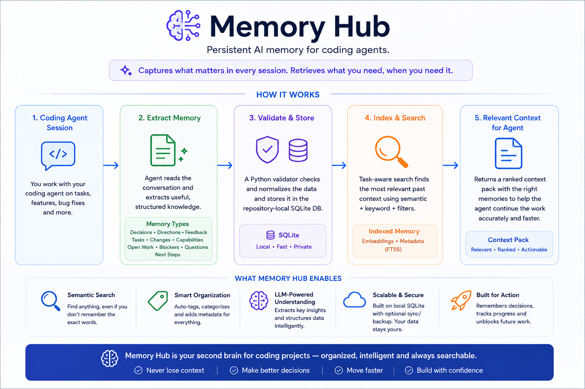
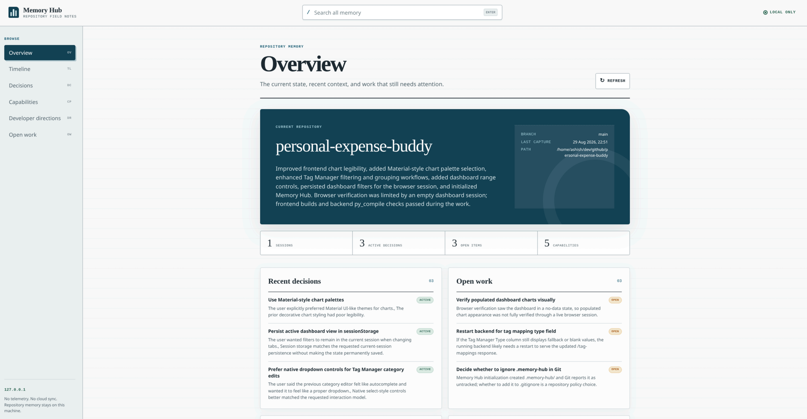

# Memory Hub

[](https://skills.sh/AshishSalaskar1/memory-hub/memory-hub)

Memory Hub gives a repository durable memory. It records decisions, developer directions, unfinished work, capabilities, and feedback, then retrieves only what matters for the current task.

> Git remembers what changed. Memory Hub remembers why.

Memory stays in repository-local SQLite. There is no account, cloud service, telemetry, or raw transcript archive.



## Quick start

Install the skill from your project directory:

```bash
npx skills@latest add AshishSalaskar1/memory-hub
```

Initialize repository memory:

```text
/memory-hub init
```

Initialization creates `.memory-hub/` and can add a marked retrieval policy to `AGENTS.md`, `CLAUDE.md`, or `.github/copilot-instructions.md`. It never edits an instruction file without approval.

Capture useful progress before context is lost:

```text
/memory-hub checkpoint
```

Close the logical work session when finished:

```text
/memory-hub close
```

Resume later with task-aware context:

```text
/memory-hub context implement OAuth logout
```

Ask a focused historical question:

```text
/memory-hub recall why are refresh tokens stored server-side?
```

The core loop is simple: **initialize once, capture while context is available, and retrieve when needed.**

## Commands

| Command | Purpose |
|---|---|
| `/memory-hub init` | Initialize repository memory and optionally configure agent instructions |
| `/memory-hub checkpoint` | Save progress without closing the current session |
| `/memory-hub close` | Save final progress and close the session |
| `/memory-hub context [task]` | Load a compact context pack for a known task |
| `/memory-hub recall <question>` | Answer a focused historical question |
| `/memory-hub search <query>` | List compact matching memories without full details |
| `/memory-hub timeline <record-id>` | Show work surrounding one memory |
| `/memory-hub details <record-id>...` | Fetch complete selected records in one batch |
| `/memory-hub feedback` | Store a correction, concern, suggestion, or positive note |
| `/memory-hub status` | Show memory health and recent activity |
| `/memory-hub dream` | Audit the store and preview safe repairs |
| `/memory-hub export [target]` | Generate readable Markdown exports |
| `/memory-hub server` | Open the local browser interface |
| `/memory-hub stop` | Stop the local browser interface |

Natural-language requests work too, such as `Checkpoint this session` or `Recall why SQLite was chosen`.

## Retrieval

Memory Hub has two direct retrieval commands and a fine-grained three-layer workflow.

| Need | Use |
|---|---|
| Broad orientation for a known, substantial task | `context` |
| One specific historical answer | `recall` |
| A survey of potentially relevant memories | `search` |
| The sequence around a selected memory | `search`, then `timeline` |
| Full rationale, evidence, or record fields | `search`, then `details` |

### Direct retrieval

`context` creates a ranked task context containing active decisions, developer directions, capabilities, relevant files, and open work:

```text
/memory-hub context implement Markdown export
```

Compact mode is the default: up to 12 records and 5,000 characters. Use `--profile standard` or `--profile detailed` only when more context is justified.

`recall` returns complete matches for a focused question:

```text
/memory-hub recall what authentication constraints did the developer specify?
```

### Three-layer retrieval

When relevance is uncertain, peel memory progressively:

```text
# 1. Survey a compact index
/memory-hub search token revocation

# 2. Inspect surrounding work if sequence matters
/memory-hub timeline dec_01abc123

# 3. Fetch only the selected complete records
/memory-hub details dec_01abc123 fdb_01def456
```

1. `search` returns IDs, types, titles, status, confirmation, date, score, and estimated detail cost. It does not return full rationale or body fields.
2. `timeline` returns a bounded window from the anchor record's captured work session.
3. `details` returns complete records and accepts multiple IDs in one request.

Stop after any layer that provides enough information. Start with a small search limit, use timeline only when chronology matters, and batch selected IDs into one details request.

The underlying CLI supports:

```text
search:   <query> [--task <task>] [--limit N] [--offset N] [--type <type>] [--json]
timeline: <record-id> [--before N] [--after N] [--json]
details:  <record-id>... [--json]
```

Superseded records are excluded from normal search and recall. Retrieved memory is supporting context; current code, tests, and explicit developer instructions remain authoritative.

## Capture

`checkpoint` and `close` can preserve:

- Completed and in-progress tasks
- Decisions and rationale
- Developer instructions and corrections
- Changed files and Git evidence
- Capabilities, blockers, questions, and next steps

Memory Hub stores structured summaries, not conversations. The agent handles semantic extraction and uncertainty; the local runtime validates and stores records, IDs, timestamps, provenance, and Git facts.

Run `checkpoint` while the useful context is still available. Memory Hub does not inspect proprietary agent session databases and cannot reconstruct context after it has been lost.

## Agent instructions

`init` can maintain this policy inside a supported instruction file:

```markdown
<!-- memory-hub:start -->
## Repository Memory

When `.memory-hub/memory.db` exists, load the installed `memory-hub` skill before work that depends on repository history, architecture, conventions, prior decisions, or unresolved work.

Choose the smallest retrieval path that answers the need:

1. Use compact `context` for broad orientation at the start of a known, substantial task.
2. Use `recall` for a focused historical question when a direct answer is sufficient.
3. When relevance is uncertain, use the three-layer workflow: `search` for a compact index, `timeline` only when sequence or surrounding work matters, then `details` for only the selected record IDs.

Start with small search limits, batch IDs in one `details` request, and stop retrieving when enough evidence is available. Skip retrieval for isolated fixes, trivial requests, and unrelated work.

Treat memory as supporting context. Current code, tests, and explicit developer instructions remain authoritative; verify implementation claims against the repository.
<!-- memory-hub:end -->
```

The markers let repeated initialization update the block without duplicating it.

## Local browser

Start the browser with:

```text
/memory-hub server
```

It provides repository overview, sessions, timeline, search, decisions, directions, capabilities, feedback, open work, editing, and exports.



Exports are available as standalone HTML, a Markdown ZIP, or a portable artifact containing a consistent database snapshot. The browser binds only to `127.0.0.1`.

```text
/memory-hub stop
```

## Storage and requirements

Repository memory lives in:

```text
.memory-hub/
|-- memory.db
|-- config.json
|-- exports/
`-- server.json
```

`memory.db` is authoritative. Exports are generated views and should not be edited as a persistence mechanism.

Full mode requires Python 3.10+, Git, an Agent Skills-compatible host, and permission to run the bundled script. Without those capabilities, Memory Hub can prepare capture data in the conversation but cannot persist, retrieve, verify Git state, export, or run the browser.

Review the database before sharing it because repository memory may contain internal project context. Suspected secrets are rejected during capture.

## Reference

- [Agent contract](skills/memory-hub/SKILL.md)
- [Capture schema](skills/memory-hub/references/capture-schema.md)
- [Memory types and authority](skills/memory-hub/references/memory-types.md)
- [Capture workflow](skills/memory-hub/references/capture.md)
- [Retrieval workflow](skills/memory-hub/references/retrieval.md)
- [Feedback workflow](skills/memory-hub/references/feedback.md)
- [Administration](skills/memory-hub/references/admin.md)

## Development

The runtime and tests use only the Python standard library:

```bash
python3 -m unittest discover -s tests -v
python3 -m py_compile skills/memory-hub/scripts/memory_hub.py
node --check skills/memory-hub/assets/web/app.js
```

## License

[MIT](LICENSE)
